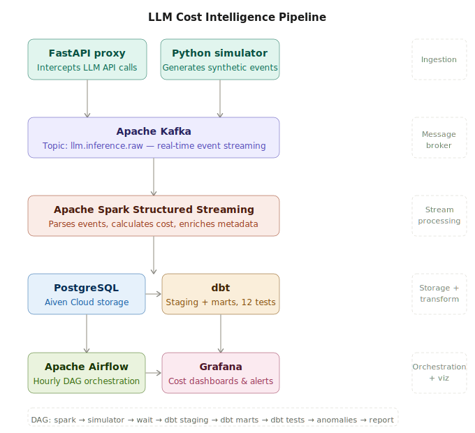

# LLM Cost Intelligence Pipeline

A production-grade real-time data engineering pipeline that tracks, processes, and visualises LLM API costs across teams and models.

## Architecture



## Tech Stack

| Layer | Technology |
|---|---|
| Ingestion | FastAPI proxy, Python simulator |
| Message Broker | Apache Kafka |
| Stream Processing | Apache Spark Structured Streaming |
| Storage | PostgreSQL (Aiven Cloud) |
| Transformation | dbt (staging + marts) |
| Orchestration | Apache Airflow |
| Visualisation | Grafana |

## Features

- Real-time event streaming via Kafka
- Multi-model cost attribution across OpenAI, Anthropic, and xAI
- Team-level cost tracking across engineering, product, data, marketing, and support
- Automated anomaly detection via dbt mart and Airflow
- 12 dbt data quality tests across staging and marts
- Fully orchestrated hourly Airflow DAG

## Airflow DAG

start_spark_streaming → run_simulator → wait_for_spark → run_dbt_staging → run_dbt_marts → run_dbt_tests → check_anomalies → generate_cost_report

## Setup

```bash
git clone https://github.com/your-username/llm-cost-tracker.git
cd llm-cost-tracker
python -m venv venv
source venv/bin/activate
pip install -r requirements.txt
```

Create a `.env` file:

```env
GROQ_API_KEY=your_groq_api_key
KAFKA_BOOTSTRAP_SERVERS=localhost:9092
KAFKA_TOPIC=llm.inference.raw
```

## Author

Kelly — Data Engineer
